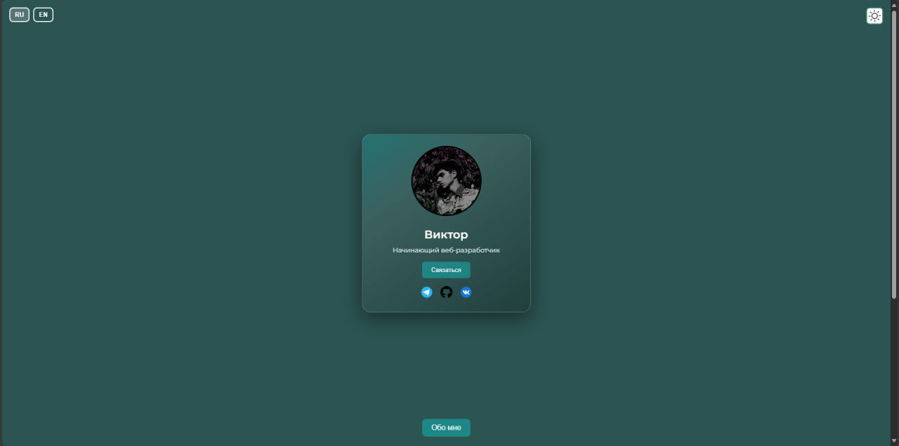

# 💼 Портфолио — Карточка-визитка

_Моя личная карточка-визитка: фото, краткая информация, контакты и ссылки на соцсети._

## 🚀 Демо
Сайт доступен по адресу: [https://USERNAME.github.io/REPO/](https://USERNAME.github.io/REPO/)

## ✨ Функционал
- 📸 Фото и краткое описание
- 📬 Кнопка «Связаться» (открывает почту)
- 🌐 Ссылки на соцсети (Telegram, GitHub, VK)
- 🌓 Переключение светлой / тёмной темы
- 🌍 Поддержка двух языков (RU / EN)
- 📖 Секция «Обо мне» с подробной биографией

## 🛠 Технологии
- **HTML5** — структура
- **CSS3** — стили, градиенты, эффекты
- **JavaScript** — логика кнопок, перевод, тема
- **GitHub Pages** — хостинг сайта

## 📧 Контакты
- Email: ananumys.viktor2015@gmail.com  
- Telegram: [@ve0rns](https://t.me/ve0rns)  
- GitHub: [vispir](https://github.com/vispir)  
- VK: [veorns](https://vk.com/veorns)

---

# 💼 Portfolio — Business Card

_My personal business card: photo, short description, contacts and social links._

## 🚀 Demo
Site is available at: [https://USERNAME.github.io/REPO/](https://USERNAME.github.io/REPO/)

## ✨ Features
- 📸 Profile photo and short info
- 📬 “Contact” button (opens email client)
- 🌐 Social links (Telegram, GitHub, VK)
- 🌓 Light / Dark theme switch
- 🌍 Two languages (RU / EN)
- 📖 “About me” section with detailed biography

## 🛠 Technologies
- **HTML5** — structure
- **CSS3** — styles, gradients, effects
- **JavaScript** — buttons logic, translation, theme
- **GitHub Pages** — hosting

## 📧 Contacts
- Email: ananumys.viktor2015@gmail.com  
- Telegram: [@ve0rns](https://t.me/ve0rns)  
- GitHub: [vispir](https://github.com/vispir)  
- VK: [veorns](https://vk.com/veorns)

---

⭐ Если проект понравился — поддержи его звёздочкой!  
⭐ If you like the project — give it a star!
